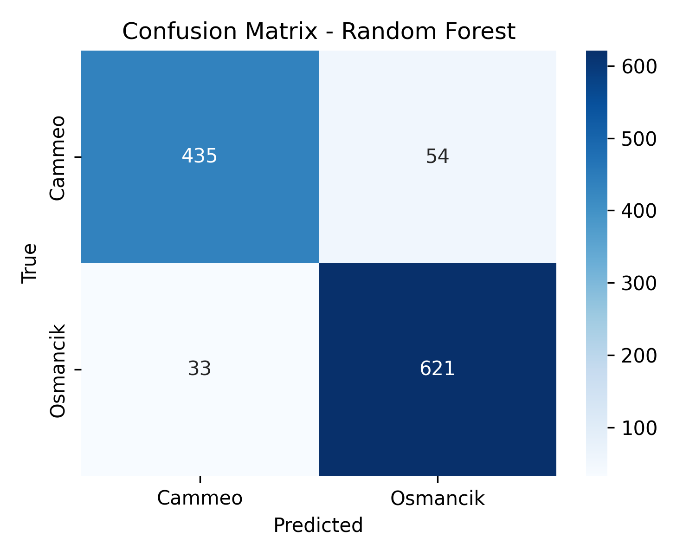
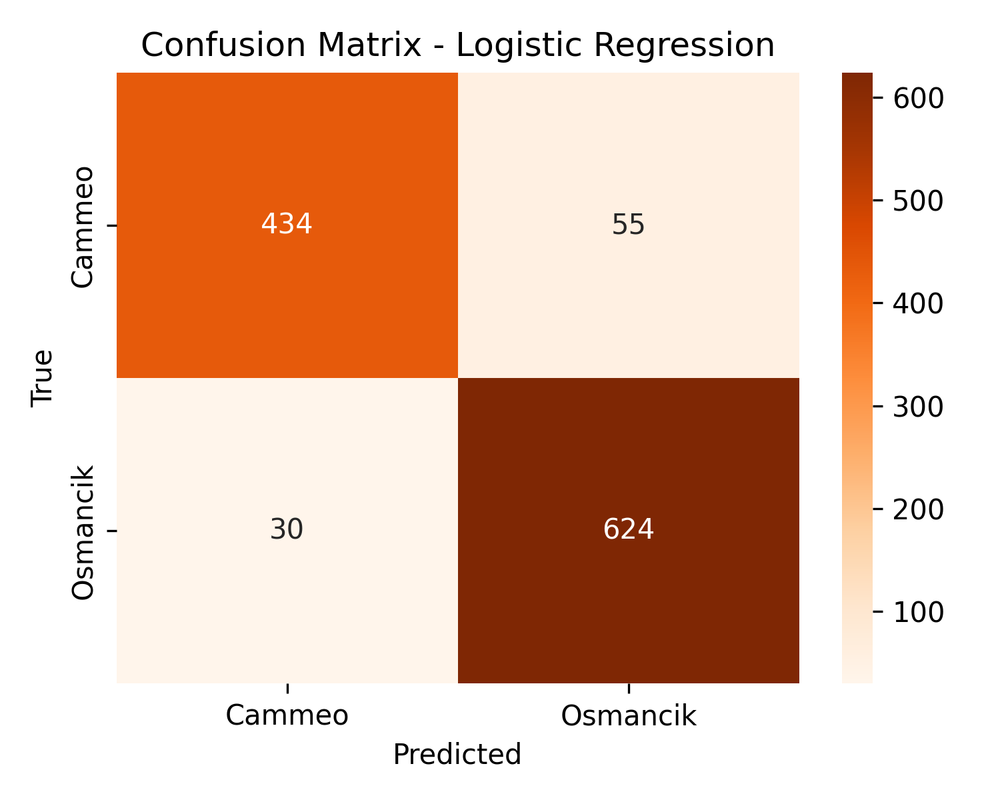
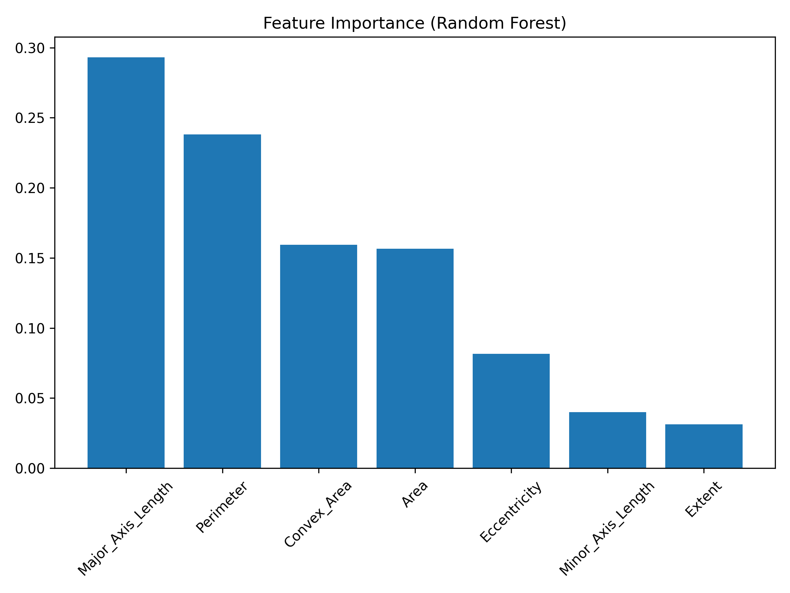

#### rice-classification-ml
# Rice Variety Classification (Cammeo vs Osmancik)


-orange)


> Classifying Cammeo and Osmancik rice varieties using 7 morphological traits and machine learning models. This project explores both a baseline (Logistic Regression) and an ensemble method (Random Forest), comparing their performance and visualizing key insights. Originally explored in a group project, I later revisited and rebuilt the analysis independently, extended it with additional evaluation (10-run reliability check).

### Why I Built This
- Practice **end-to-end ML workflow** (EDA → training → evaluation → visualization)
- Compare a simple linear baseline (Logistic Regression) with a stronger ensemble method (Random Forest).
- Extend the work with **extra evaluation** (10-run statistics, logistic regression baseline)
  
This project gave me the opportunity to:
- Explore **7 morphological traits** of rice grains (Area, Perimeter, Axis Lengths, etc.)  
- Apply **Random Forest** and compare it with a **Logistic Regression baseline**  
- Apply EDA visualizations to check feature separability. (scatter plots, boxplots, feature importance)
- Evaluate classification performance with precision, recall, and f1-scores.
- Repeated runs (with different seeds) improve **reliability of results**

---
### Dataset
- Source: Kaggle–Rice (Cammeo and Osmancik) 👉 https://www.kaggle.com/datasets/muratkokludataset/rice-dataset-commeo-and-osmancik
- Download: https://www.kaggle.com/api/v1/datasets/download/muratkokludataset/rice-dataset-commeo-and-osmancik
- Size: 3,810 rice grain samples
- Features (7):
  1. Area
  2. Perimeter
  3. Major Axis Length
  4. Minor Axis Length
  5. Eccentricity
  6. Convex Area
  7. Extent
- Target: Rice variety (Cammeo or Osmancik)

---

### Methods
<summary> Train–Test Split </summary>

```python
X = dataFrame.drop(['Class'], axis=1)
y = dataFrame['Class']

# Reproducible split; stratify preserves class balance in train/test
X_train, X_test, y_train, y_test = train_test_split(
    X, y, test_size=0.30, random_state=42, stratify=y)
```

<summary> Random Forest Classifier </summary>

```python
clf = RandomForestClassifier(n_estimators=1000, random_state=42, n_jobs=-1)
clf.fit(X_train, y_train)
y_pred = clf.predict(X_test)

acc = accuracy_score(y_test, y_pred)
print(f"Single-run Accuracy: {acc:.4f}\n")
print(classification_report(y_test, y_pred))
 ```
<summary> Logistic Regression (Baseline) </summary>
  
```python
log_model = LogisticRegression(max_iter=1000, n_jobs=-1)  # parallel if available
log_model.fit(X_train, y_train)
y_pred_log = log_model.predict(X_test)
# text metrics to console
print("\n[Logistic Regression]")
print("Accuracy:", accuracy_score(y_test, y_pred_log))
print(classification_report(y_test, y_pred_log))
```
<summary> Code: 10-run evaluation with Random Forest + save report in .txt </summary>

```python
  DO_TEN_RUNS = True  # set True = produce 10-run stats, False = 1-run stat
        if DO_TEN_RUNS:
            seeds = range(10) # 10 different random seeds
            cam_precision, cam_recall, cam_f1 = [], [], []
            osm_precision, osm_recall, osm_f1 = [], [], []

  with open("Classification_Report_10runs.txt", "w", encoding="utf-8") as f:
      for i, seed in enumerate(seeds, start=1):
          # 4.1 new split per run - make experiment independent
          Xtr, Xte, ytr, yte = train_test_split(X, y, test_size=0.30, random_state=seed, stratify=y)
          # 4.2 re-train model for thhe split/seed
          model = RandomForestClassifier(n_estimators=1000, random_state=seed, n_jobs=-1).fit(Xtr, ytr)
          
          # 4.3 predict & evaluate
          yp = model.predict(Xte)
          rep = classification_report(yte, yp)
          rep_dict = classification_report(yte, yp, output_dict=True)
          rep_df = pd.DataFrame(rep_dict).transpose()
          
          # 4.4 collect per-class metrics (Cammeo, Osmancik) for stats
          cam_precision.append(rep_df.loc['Cammeo', 'precision'])
          cam_recall.append(rep_df.loc['Cammeo', 'recall'])
          cam_f1.append(rep_df.loc['Cammeo', 'f1-score'])

          osm_precision.append(rep_df.loc['Osmancik', 'precision'])
          osm_recall.append(rep_df.loc['Osmancik', 'recall'])
          osm_f1.append(rep_df.loc['Osmancik', 'f1-score'])

          # seperator of each run so it's neat
          print(f"===================== ({i}) =====================\n{rep}\n", file=f)
  
  # summarize variability so it's neat
  summary = pd.DataFrame({
      'metric': ['precision','recall','f1-score']*2,
      'class':  ['Cammeo']*3 + ['Osmancik']*3,
      'mean':   [np.mean(cam_precision), np.mean(cam_recall), np.mean(cam_f1),
                 np.mean(osm_precision), np.mean(osm_recall), np.mean(osm_f1)],
      'std':    [np.std(cam_precision), np.std(cam_recall), np.std(cam_f1),
                 np.std(osm_precision), np.std(osm_recall), np.std(osm_f1)]
  })
  summary.to_csv("PRF_10runs_summary.csv", index=False)
  print("\nSaved 10-run summary to PRF_10runs_summary.csv")
```
---
### Result & Analysis
**Exploratory Data Analysis (EDA): Class Distribution**
<summary> Balanced Dataset with a slight dominance of Cammeo (blue) 57.2% than Osmancik (orange) 42.8% </summary>


**Exploratory Data Analysis (EDA): Feature Distributions**
<summary> Boxplots show clear differences in Area, Perimeter, and Axis Lengths, which later emerge as the most important features. </summary>


**Scatter Plots**
<summary> Certain pairs of features reveal strong separability between varieties (e.g., Area vs Perimeter). Others, like Extent, show more overlap. </summary>
<p align="center">
  
  
  
  
  
  
</p>

---

**Model Result**

*Confusion Matrices*
- Both models performed strongly (~91–92% accuracy).
- Random Forest reduced misclassifications slightly more than Logistic Regression.
<summary> Random Forest vs Logistic Regression </summary>
<p align="center">


</p>

*Feature Importance*
- Random Forest shows that Major Axis Length, Perimeter, and Convex Area were the most important traits.
<summary> Feature Importance (Random Forest) </summary>


*10-run Reliability Check (Random Forest)*
- To ensure the model’s stability, I repeated training/testing across 10 random seeds.
- Results show consistent accuracy and low variability (std ~0.01).
<summary> Summary of the 10-run Reliability Check (Random Forest) </summary>

| Metric     | Class     | Mean  | Std   |
|------------|-----------|-------|-------|
| Precision  | Cammeo    | 0.92  | 0.01  |
| Recall     | Cammeo    | 0.90  | 0.01  |
| F1-score   | Cammeo    | 0.91  | 0.01  |
| Precision  | Osmancik  | 0.93  | 0.01  |
| Recall     | Osmancik  | 0.94  | 0.01  |
| F1-score   | Osmancik  | 0.93  | 0.01  |

- See full result of the 10-run: [Classification_Report_10runs.txt](./.txt/Classification_Report_10runs.txt)
---
### Model Comparison
| Model                  | Accuracy | Notes                                        |
| ---------------------- | -------- | -------------------------------------------- |
| Logistic Regression    | \~90%    | Baseline linear model, interpretable         |
| Random Forest (1-run)  | \~91–92% | Slightly higher accuracy, feature importance |
| Random Forest (10-run) | \~91–92% | Stable across multiple seeds                 |
---
### Key Takeaways
- EDA confirmed morphological features (especially Area & Axis Lengths) separate rice varieties well.
- Logistic Regression provided a solid baseline with ~90% accuracy.
- Random Forest performed slightly better (~92%) and highlighted key features.
- 10-run evaluation confirmed the model is robust and reliable (low variance).
---
### References
Rice Dataset (Kaggle)
Scikit-learn documentation
